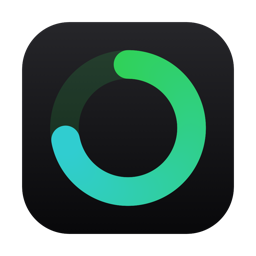

<div align="center">
  
  <h1>AI-usage</h1>
  <p>A tiny, fast macOS menu bar app that shows your Claude usage at a glance.</p>
</div>

---

AI-usage lives in your macOS menu bar and shows the current **session (5h)** and
**weekly (7d)** Claude limit utilization, plus when each window resets — using
the same official data source as Claude Code's `/usage`, with no log scraping.

```
menu bar:   ◔ 27% / 18%
            └ session% / weekly%, with a colored gauge for the session

dropdown:   Session (5h)   27%   resets 23:09
            Weekly (7d)    18%   resets Jun 4
            ─────────────
            Quit
```

## Features

- **Session + weekly utilization** with reset times, read straight from the
  official OAuth usage endpoint (the one `/usage` uses).
- **Colored session gauge** in the bar — a small pie tinted green → red by level.
- **Refreshes the moment it matters**: on each conversation turn (watches
  `~/.claude/projects`), when you open the menu, at each limit reset boundary,
  and on a 60s heartbeat.
- **Automatic token refresh** — refreshes the OAuth token via its refresh-token
  when it expires and writes it back, so it keeps working even after Claude Code
  has been idle.
- **Native & light** — pure AppKit via `objc2`, no Electron/web runtime. Real
  memory footprint ~17 MB (the AppKit baseline), stable, ~0% idle CPU.
- **Launch at login**, no Dock icon (menu bar agent).
- **Extensible** — a single `Provider` trait is the extension point for future
  sources (Anthropic API usage, Codex, …).

## Requirements

- macOS 11+ (Apple Silicon or Intel)
- Rust ≥ 1.85 (dependencies use edition 2024)
- Logged in to Claude Code (the app reads its OAuth token from the Keychain)

## Install

```sh
git clone <your-fork-url> AI-usage && cd AI-usage
scripts/setup-signing.sh   # optional, once — see "Code signing" below
scripts/install.sh         # build, sign, install to /Applications, start at login
```

Find **AI-usage** in Finder → Applications (or Launchpad / Spotlight). On first
launch macOS prompts once for Keychain access — choose **Always Allow**.

Uninstall with `scripts/uninstall.sh`.

## Build & run (dev)

```sh
cargo run            # the status item appears in the menu bar
cargo test           # unit tests (parsing + refresh scheduling)
cargo build --release
```

## How it works

- **Token** — read from the macOS Keychain generic-password item
  `Claude Code-credentials` (`claudeAiOauth.accessToken` / `refreshToken` /
  `expiresAt`), re-read each poll and refreshed on expiry.
- **Usage** — `GET https://api.anthropic.com/api/oauth/usage` with
  `Authorization: Bearer <token>` and `anthropic-beta: oauth-2025-04-20`,
  returning `five_hour` (session) and `seven_day` (weekly) utilization + reset
  times.
- **Refresh** — `POST https://platform.claude.com/v1/oauth/token`
  (`grant_type=refresh_token`) when the token is near expiry or returns 401.

A worker thread does all I/O and writes a shared `AppState`; the main thread
only reads it (AppKit must be touched on the main thread only).

### Proxy

`api.anthropic.com` returns **403 on direct access in some regions** and must be
reached through an HTTP proxy. AI-usage uses the first `http://` proxy from
`HTTPS_PROXY` / `HTTP_PROXY`, then falls back to the macOS system proxy
(`scutil --proxy`) so a login-launched app works without shell env. `install.sh`
also bakes the resolved proxy into the LaunchAgent. (`ALL_PROXY` / socks5 is
ignored.)

### Code signing

`setup-signing.sh` creates a self-signed code-signing identity in your login
keychain so `install.sh` can sign the bundle with a **stable** identity. That
keeps the Keychain "Always Allow" grant from being revoked every rebuild. It is
self-signed (not Apple-notarized) — fine because the app is launched directly,
not distributed. Skip it and `install.sh` falls back to ad-hoc signing.

## Architecture

```
src/
  main.rs              NSApplication (accessory) bootstrap + run loop
  menubar.rs           status item + dropdown; redraws from state
  gauge.rs             session % pie as a colored NSImage (green→red ramp)
  poller.rs            worker thread: triggers → fetch → Arc<Mutex<AppState>>
  watch.rs             notify watcher on ~/.claude/projects (refresh per turn)
  token.rs             OAuth access-token cache + refresh-token rotation
  keychain.rs          read/write the Claude OAuth credentials in the Keychain
  provider/
    mod.rs             Provider trait + UsageWindow / UsageSnapshot / FetchError
    claude.rs          ClaudeProvider: keychain → HTTP GET → parse
packaging/             Info.plist + AppIcon.icns
scripts/               install / uninstall / signing / icon generation
```

### Adding a provider

Implement `Provider::fetch() -> Result<UsageSnapshot, FetchError>` in
`provider/<name>.rs`, normalize into `UsageWindow { label, utilization,
resets_at }`, and wire it in `main.rs`. The UI and poller are provider-agnostic.

## Roadmap

- Opus / Sonnet weekly breakdown + `extra_usage` display
- Anthropic API usage / Codex providers
- Notarized/signed release builds

## Notes

- **Memory**: Activity Monitor may show ~50 MB *RSS*, but most of that is shared
  macOS framework pages; the app's real private footprint is ~17 MB and stable.
- The OAuth token is read from the Keychain at runtime only — never logged or
  persisted by this app.

## License

MIT — see [LICENSE](LICENSE).
